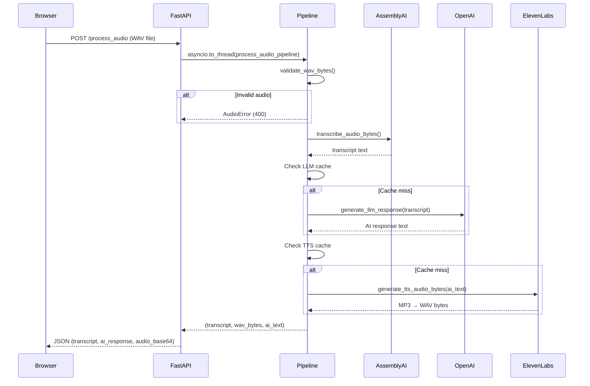
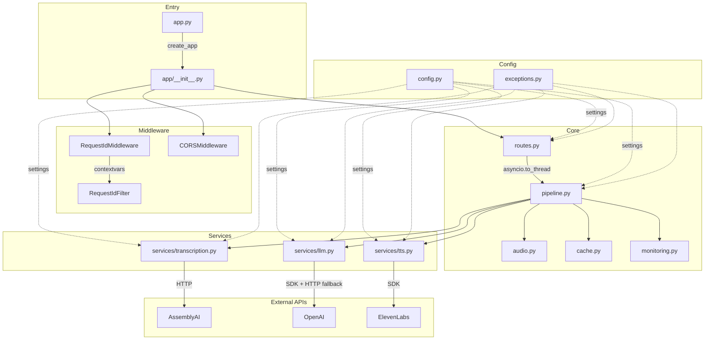

# AI Interview Assistant

A voice-based AI interview practice application. Users speak into their browser, audio is transcribed via AssemblyAI, processed by an OpenAI LLM, and the response is spoken back through ElevenLabs TTS. Designed for Hugging Face Spaces (in-memory only, no persistent storage).

## Features

- **Voice Recording** — Record interview questions directly in the browser (up to 30 seconds)
- **Real-time Visualization** — Canvas-based frequency bars and waveform display during recording
- **Speech-to-Text** — Automatic transcription using AssemblyAI (with language detection fallback)
- **AI Responses** — Context-aware answers powered by OpenAI GPT, simulating an early-career ML professional
- **Text-to-Speech** — Natural voice output via ElevenLabs
- **In-memory Caching** — Thread-safe LRU cache with TTL to reduce repeat API calls
- **Concurrency Control** — Semaphore-based request limiting (default: 3 concurrent)
- **Request Tracing** — Unique request IDs in all log entries for debugging

## Architecture

### Process Flow



### Backend Architecture



### Project Structure

```
genai_voicebot/
├── app/                          # Backend package
│   ├── __init__.py               # FastAPI app factory, lifespan, logging setup
│   ├── config.py                 # Pydantic Settings (all config centralized)
│   ├── exceptions.py             # VoicebotError hierarchy
│   ├── cache.py                  # Thread-safe InMemoryCache (TTL + LRU)
│   ├── audio.py                  # Audio validation, numpy ↔ WAV conversion
│   ├── monitoring.py             # PerformanceMetrics + PerformanceMonitor
│   ├── pipeline.py               # Orchestrator: validate → transcribe → LLM → TTS
│   ├── routes.py                 # API endpoints (/, /health, /process_audio)
│   ├── middleware.py             # Request ID, security headers, log_timing
│   └── services/
│       ├── transcription.py      # AssemblyAI integration
│       ├── llm.py                # OpenAI integration (SDK + HTTP fallback)
│       └── tts.py                # ElevenLabs integration (MP3 → WAV)
├── static/
│   ├── css/styles.css            # Extracted stylesheet
│   └── js/
│       ├── app.js                # Main orchestrator (ES module)
│       ├── recorder.js           # AudioRecorder (MediaRecorder + Web Audio)
│       ├── visualizer.js         # Canvas frequency bars + waveform
│       └── wav-encoder.js        # WebM → WAV conversion
├── templates/
│   └── index.html                # HTML markup only
├── prompts/
│   └── interview_system.txt      # LLM system prompt (externalized)
├── tests/
│   ├── conftest.py               # Shared fixtures (sample WAV bytes, etc.)
│   ├── test_config.py
│   ├── test_cache.py
│   ├── test_audio.py
│   ├── test_pipeline.py
│   └── test_routes.py
├── app.py                        # Thin entry point (8 lines)
├── pyproject.toml                # Dependencies + tool config
├── .env.example                  # API key template
└── CLAUDE.md                     # AI coding assistant context
```

## Prerequisites

- Python 3.11+
- API keys for: [OpenAI](https://platform.openai.com/), [AssemblyAI](https://www.assemblyai.com/), [ElevenLabs](https://elevenlabs.io/)

## Installation

```bash
# Clone and enter project
git clone https://github.com/yourusername/genai-voicebot.git
cd genai-voicebot

# Install (with dev tools)
pip install -e ".[dev]"

# Configure API keys
cp .env.example .env
# Edit .env with your keys
```

## Usage

```bash
# Start the server (default port 7860)
python app.py
```

Open `http://localhost:7860`, click **Start Recording**, speak your question, then click **Generate AI Response**.

## API Endpoints

| Method | Path | Description | Status Codes |
|--------|------|-------------|--------------|
| `GET` | `/` | Serves the interview UI | 200 |
| `GET` | `/health` | Health check + performance metrics | 200 |
| `POST` | `/process_audio` | Main pipeline: audio → transcript → LLM → TTS | 200, 400, 502, 503 |

### `POST /process_audio`

**Request:** `multipart/form-data` with an `audio` field (WAV file)

**Response:**
```json
{
  "transcript": "What is machine learning?",
  "ai_response": "Machine learning is a subset of AI...",
  "audio_base64": "UklGR..."
}
```

**Error mapping:**

| Exception | HTTP Status | Meaning |
|-----------|-------------|---------|
| `AudioError` | 400 | Invalid/empty/silent audio |
| `TranscriptionError` | 502 | AssemblyAI failure |
| `LLMError` | 502 | OpenAI failure |
| `TTSError` | 502 | ElevenLabs failure |
| `ConfigurationError` | 503 | Missing API keys |

## Configuration

All settings are managed via environment variables (loaded from `.env`) through Pydantic Settings in `app/config.py`:

| Variable | Default | Description |
|----------|---------|-------------|
| `OPENAI_API_KEY` | — | OpenAI API key (required) |
| `ASSEMBLYAI_API_KEY` | — | AssemblyAI API key (required) |
| `ELEVENLABS_API_KEY` | — | ElevenLabs API key (required) |
| `OPENAI_MODEL` | `gpt-3.5-turbo` | GPT model to use |
| `LLM_MAX_TOKENS` | `200` | Max tokens per LLM response |
| `LLM_TEMPERATURE` | `0.7` | LLM sampling temperature |
| `TTS_VOICE_ID` | `3gsg3cxXyFLcGIfNbM6C` | ElevenLabs voice ID |
| `MAX_CONCURRENT_REQUESTS` | `3` | Semaphore limit |
| `CACHE_TTL_HOURS` | `24` | Cache entry lifetime |
| `CACHE_MAX_ENTRIES` | `100` | Max cached items (LRU eviction) |
| `CORS_ORIGINS` | `["*"]` | Allowed CORS origins |
| `PORT` | `7860` | Server port |
| `LOG_LEVEL` | `INFO` | Logging level |

## Development

```bash
# Run tests
pytest tests/

# Run tests with coverage
pytest --cov=app tests/

# Lint
ruff check .
```

## Tech Stack

| Layer | Technology |
|-------|-----------|
| Web framework | FastAPI + Uvicorn |
| Configuration | Pydantic Settings |
| Speech-to-text | AssemblyAI |
| LLM | OpenAI GPT |
| Text-to-speech | ElevenLabs |
| Audio processing | NumPy, SciPy, soundfile, pydub |
| Frontend | Vanilla JS (ES modules), Web Audio API, Canvas API |
| Testing | pytest, pytest-asyncio, pytest-cov |
| Linting | Ruff |

## Browser Support

Chrome/Edge (recommended), Firefox, Safari (limited audio format support). Requires MediaRecorder API, Web Audio API, and Canvas API.

## Limitations

- Max recording: 30 seconds / 5 MB
- In-memory cache only (no persistence across restarts)
- Requires internet for all three external APIs
- No user authentication (designed as a practice tool)

## License

MIT License

## Acknowledgments

- [OpenAI](https://openai.com/) — GPT models
- [AssemblyAI](https://www.assemblyai.com/) — Speech recognition
- [ElevenLabs](https://elevenlabs.io/) — Text-to-speech
- [FastAPI](https://fastapi.tiangolo.com/) — Web framework
